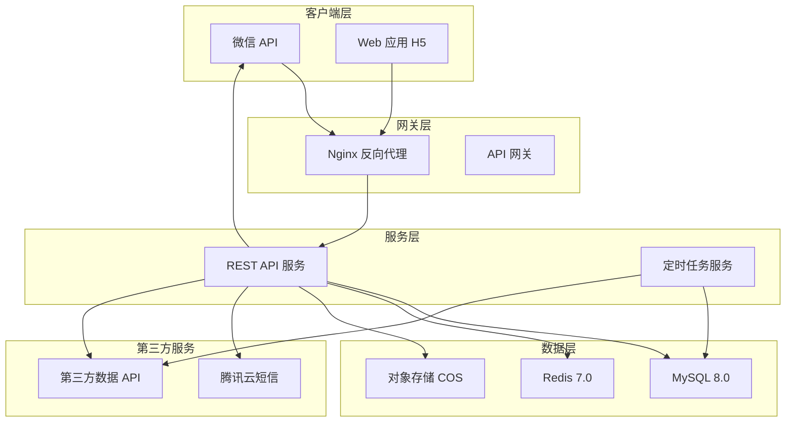
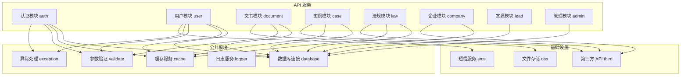
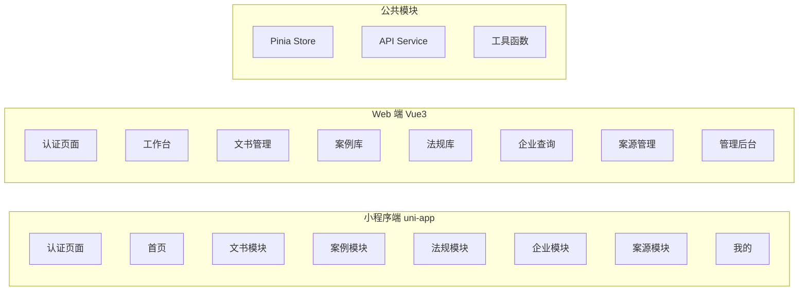
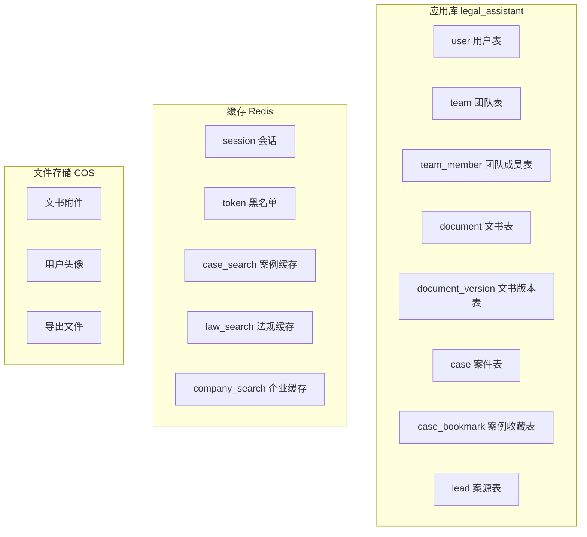
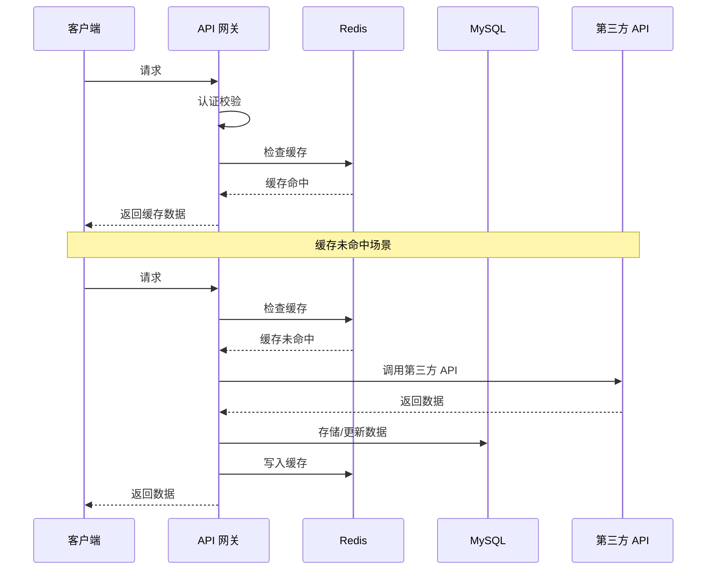
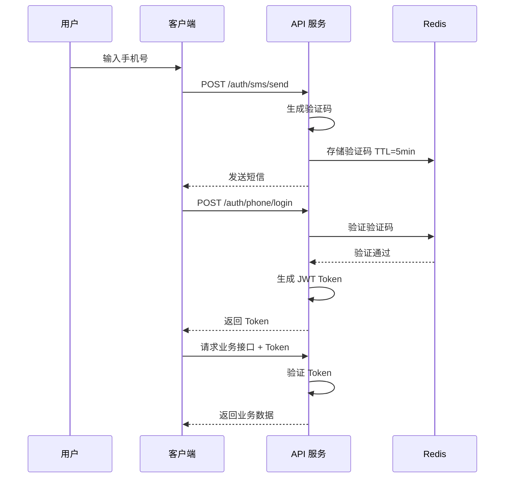
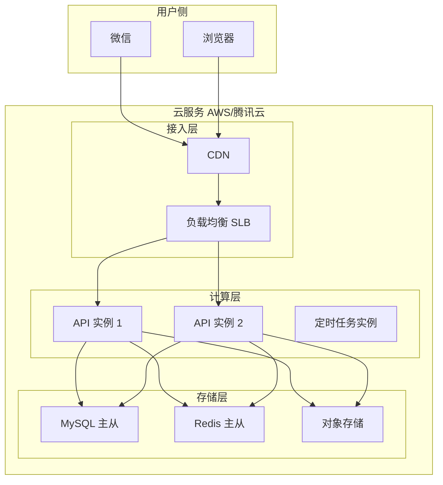
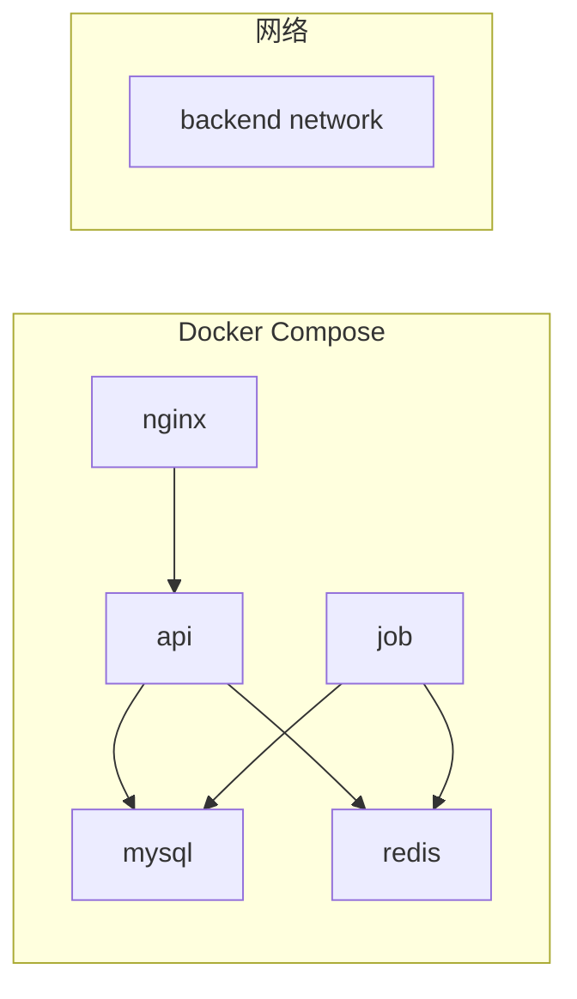

# 法律助手 (LegalAssistant) 系统架构文档

## 1. 项目概述

### 1.1 项目简介

法律助手是一款面向律师和法律从业者的效率工具小程序，提供法律文书起草、案例查询、法规查询、企业调查、案源发现等一站式服务。

### 1.2 项目信息

| 属性 | 值 |
|-----|-----|
| 项目名称 | 法律助手 (LegalAssistant) |
| 项目类型 | 微信小程序 + Web 应用双端 |
| 技术架构 | 前后端分离 |
| 目标用户 | 执业律师、法律顾问、法务人员 |
| 开发阶段 | MVP (最小可行产品) |

---

## 2. 系统架构

### 2.1 整体架构

### 2.2 技术栈概览

#### 前端技术栈

| 类别 | 技术选型 | 说明 |
|-----|---------|------|
| 跨端框架 | uni-app | 一套代码编译为微信小程序 + H5 |
| Web 框架 | Vue 3 + Vite | 现代响应式前端框架 |
| 状态管理 | Pinia | Vue 3 官方推荐状态管理库 |
| UI 组件 | uView (小程序) / Element Plus (Web) | 成熟 UI 组件库 |
| HTTP 库 | Axios | HTTP 请求封装 |
| 路由 | uni-app 路由 / Vue Router | 路由管理 |

#### 后端技术栈

| 类别 | 技术选型 | 说明 |
|-----|---------|------|
| 运行时 | Node.js 18+ | JavaScript 运行时环境 |
| 框架 | NestJS | 企业级 Node.js 框架 |
| ORM | Prisma | 现代数据库 ORM |
| 数据库 | MySQL 8.0 | 关系型数据库 |
| 缓存 | Redis 7.0 | 高性能缓存 |
| 文件存储 | 腾讯云 COS | 对象存储服务 |
| 认证 | JWT | 无状态身份令牌 |

---

## 3. 模块架构

### 3.1 后端模块划分

### 3.2 前端模块划分

---

## 4. 数据架构

### 4.1 数据库架构

### 4.2 数据流设计

---

## 5. 安全架构

### 5.1 认证流程

### 5.2 权限控制

| 角色 | 权限说明 |
|-----|---------|
| admin | 系统管理，拥有所有权限 |
| lawyer | 律师，可管理自己的文书、案例、案源 |
| assistant | 助理，可协助律师处理事务 |
| guest | 访客，仅可浏览公开信息 |

---

## 6. 部署架构

### 6.1 物理拓扑

### 6.2 容器架构

---

## 7. 监控与运维

### 7.1 监控指标

| 类别 | 指标 | 告警阈值 |
|-----|------|---------|
| 服务可用性 | API 成功率 | < 99% 告警 |
| 响应时间 | P95 延迟 | > 2s 告警 |
| 系统负载 | CPU 使用率 | > 80% 告警 |
| 存储 | 磁盘使用率 | > 85% 告警 |
| 业务 | 登录失败率 | > 10% 告警 |

### 7.2 日志规范

- 格式：JSON
- 级别：ERROR、WARN、INFO、DEBUG
- 保留：30 天
- 采集：ELK / 腾讯云日志服务

---

## 8. 扩展性设计

### 8.1 水平扩展

- API 服务无状态，可根据负载增加实例
- 使用负载均衡分发请求
- Redis 集群支持数据分片

### 8.2 垂直扩展

- 数据库读写分离
- 缓存预热和持久化
- 静态资源 CDN 加速

### 8.3 模块化扩展

- 微服务架构预留
- 消息队列解耦（后期引入）
- 插件机制扩展功能