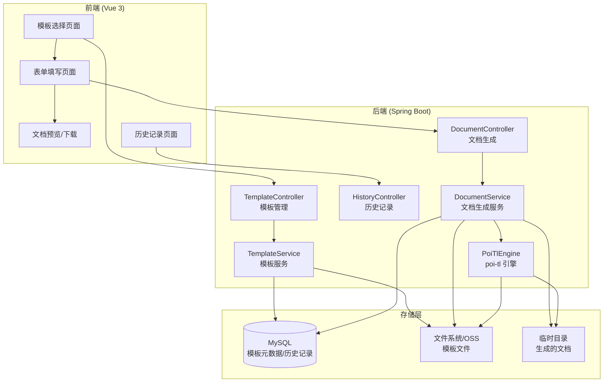

# 法律文书生成系统设计

Feature Name: document-generation  
Updated: 2026-06-04

## 描述

本系统基于 poi-tl模板引擎实现法律文书的在线生成，支持用户选择模板、填写数据、生成并下载Word文档。系统采用前后端分离架构，前端提供可视化表单，后端负责模板渲染和文件生成。

## 架构



### 架构说明

1. **前端层**: Vue 3 + Element Plus
   - 模板列表展示（分类浏览、搜索）
   - 动态表单生成（根据模板变量）
   - 文档下载和历史记录查看

2. **后端服务层**: Spring Boot
   - TemplateController: 模板 CRUD 操作
   - DocumentController: 文档生成和下载
   - HistoryController: 用户文档历史管理
   - TemplateService: 模板解析和元数据提取
   - DocumentService: 文档生成核心逻辑
   - PoiTlEngine: poi-tl 模板引擎封装

3. **存储层**:
   - MySQL: 存储模板元数据、用户生成历史
   - 文件系统/OSS: 存储模板文件和生成的文档
   - 临时目录: 临时存储生成的文档（24 小时后清理）

## 组件和接口

### 后端核心类

#### 1. Template 实体类

```java
@Data
@Entity
@Table(name = "document_templates")
public class DocumentTemplate {
    @Id
    @GeneratedValue(strategy = GenerationType.IDENTITY)
    private Long id;
    
    private String name;           // 模板名称
    private String category;       // 分类：民事、合同、婚姻等
    private String description;    // 模板描述
    private String filePath;       // 模板文件路径
    private List<String> variables; // 模板变量列表（JSON 存储）
    private Integer downloadCount; // 下载次数
    private Boolean isPublic;      // 是否公开
    private LocalDateTime createdAt;
    private LocalDateTime updatedAt;
}
```

#### 2. DocumentHistory 实体类

```java
@Data
@Entity
@Table(name = "document_histories")
public class DocumentHistory {
    @Id
    @GeneratedValue(strategy = GenerationType.IDENTITY)
    private Long id;
    
    private Long userId;           // 用户 ID
    private Long templateId;       // 模板 ID
    private String fileName;       // 生成的文件名
    private String filePath;       // 生成的文件路径
    private Map<String, Object> templateData; // 填写的模板数据（JSON）
    private LocalDateTime createdAt;
}
```

#### 3. DocumentService 服务类

```java
@Service
public class DocumentService {
    
    @Autowired
    private TemplateRepository templateRepository;
    
    @Autowired
    private HistoryRepository historyRepository;
    
    /**
     * 生成 Word 文档
     */
    public String generateDocument(Long templateId, Map<String, Object> data) throws Exception {
        // 1. 查询模板
        DocumentTemplate template = templateRepository.findById(templateId)
            .orElseThrow(() -> new BusinessException(1000, "模板不存在"));
        
        // 2. 准备数据
        Map<String, Object> templateData = prepareTemplateData(data);
        
        // 3. 使用 poi-tl 渲染模板
        String outputFileName = generateFileName(template.getName());
        String outputPath = getTempDirectory() + outputFileName;
        
        XWPFTemplate.compile(template.getFilePath())
            .render(templateData)
            .writeToFile(outputPath);
        
        // 4. 保存历史记录
        saveHistory(templateId, outputFileName, outputPath, data);
        
        // 5. 返回下载路径（临时链接，24 小时有效）
        return outputPath;
    }
    
    /**
     * 从模板文件中提取变量名
     */
    public List<String> extractVariables(String templatePath) {
        List<String> variables = new ArrayList<>();
        // 解析 DOCX 文件，提取 {{variable}} 格式的占位符
        // 使用 poi-tl 或 Apache POI 的底层 API
        return variables;
    }
}
```

#### 4. DocumentController 控制器

```java
@RestController
@RequestMapping("/api/v1/documents")
public class DocumentController {
    
    @Autowired
    private DocumentService documentService;
    
    /**
     * 生成文档
     */
    @PostMapping("/generate")
    public Result<DocumentGenerateResponse> generate(
            @Valid @RequestBody DocumentGenerateRequest request) {
        try {
            String filePath = documentService.generateDocument(
                request.getTemplateId(), 
                request.getData()
            );
            
            String downloadUrl = generateDownloadUrl(filePath);
            
            return Result.success(new DocumentGenerateResponse(
                downloadUrl, 
                filePath, 
                24 * 60 * 60  // 24 小时过期
            ));
        } catch (Exception e) {
            throw new BusinessException(1000, "文档生成失败：" + e.getMessage());
        }
    }
    
    /**
     * 下载文档
     */
    @GetMapping("/download")
    public ResponseEntity<Resource> download(@RequestParam String file) {
        // 验证文件是否存在且未过期
        // 返回文件流
    }
}
```

### 前端核心组件

#### 1. 模板选择页面

```vue
<template>
  <div class="template-list">
    <el-tabs v-model="activeCategory">
      <el-tab-pane 
        v-for="category in categories" 
        :key="category.id"
        :label="category.name"
        :name="category.id"
      >
        <el-row :gutter="20">
          <el-col 
            v-for="template in templates" 
            :key="template.id"
            :span="8"
          >
            <el-card 
              class="template-card"
              @click="selectTemplate(template)"
            >
              <h3>{{ template.name }}</h3>
              <p class="description">{{ template.description }}</p>
              <div class="meta">
                <span class="downloads">
                  📥 {{ template.downloadCount }}次下载
                </span>
              </div>
            </el-card>
          </el-col>
        </el-row>
      </el-tab-pane>
    </el-tabs>
  </div>
</template>
```

#### 2. 动态表单组件

```vue
<template>
  <el-form :model="formData" label-width="120px">
    <el-form-item
      v-for="field in formFields"
      :key="field.name"
      :label="field.label"
      :required="field.required"
    >
      <!-- 文本输入 -->
      <el-input
        v-if="field.type === 'text'"
        v-model="formData[field.name]"
        :placeholder="field.placeholder"
      />
      
      <!-- 日期选择 -->
      <el-date-picker
        v-else-if="field.type === 'date'"
        v-model="formData[field.name]"
        type="date"
        :placeholder="field.placeholder"
      />
      
      <!-- 下拉选择 -->
      <el-select
        v-else-if="field.type === 'select'"
        v-model="formData[field.name]"
        :placeholder="field.placeholder"
      >
        <el-option
          v-for="option in field.options"
          :key="option.value"
          :label="option.label"
          :value="option.value"
        />
      </el-select>
      
      <!-- 多行文本 -->
      <el-input
        v-else-if="field.type === 'textarea'"
        v-model="formData[field.name]"
        type="textarea"
        :rows="4"
        :placeholder="field.placeholder"
      />
    </el-form-item>
    
    <el-form-item>
      <el-button type="primary" @click="handleSubmit" :loading="loading">
        生成文书
      </el-button>
    </el-form-item>
  </el-form>
</template>
```

## 数据模型

### 模板元数据结构

```typescript
interface DocumentTemplate {
  id: number;
  name: string;              // 模板名称："民事起诉状"
  category: string;          // 分类："civil_litigation"
  description: string;       // 描述："用于民事案件起诉"
  filePath: string;          // 文件路径："/templates/civil/complaint.docx"
  variables: TemplateVariable[];
  downloadCount: number;
  isPublic: boolean;
  createdAt: Date;
}

interface TemplateVariable {
  name: string;              // 变量名："plaintiff_name"
  label: string;             // 显示标签："原告姓名"
  type: 'text' | 'date' | 'number' | 'select' | 'textarea';
  required: boolean;
  placeholder?: string;
  options?: Array<{value: string; label: string}>;
}
```

### API 数据类型

```typescript
// 生成文档请求
interface DocumentGenerateRequest {
  templateId: number;
  data: Record<string, any>;
}

// 生成文档响应
interface DocumentGenerateResponse {
  downloadUrl: string;       // 下载链接
  filePath: string;          // 文件路径
  expiresIn: number;         // 过期时间（秒）
}

// 模板列表响应
interface TemplateListResponse {
  categories: Array<{id: string; name: string}>;
  templates: DocumentTemplate[];
}
```

## 正确性属性

### 不变量

1. **模板文件完整性**: 模板文件必须为有效的 DOCX 格式，且包含至少一个变量占位符
2. **数据验证**: 所有必填字段必须在提交前完成验证
3. **文件访问控制**: 用户只能下载自己生成的文档
4. **临时文件清理**: 临时生成的文档必须在 24 小时后自动删除

### 约束条件

1. 单个文档生成时间不得超过 30 秒
2. 并发文档生成请求需在队列中处理，防止内存溢出
3. 模板文件大小限制：最大 10MB
4. 生成的文档文件名格式：`{template_name}_{timestamp}_{user_id}.docx`

## 错误处理

### 错误场景及处理策略

| 错误类型 | 错误代码 | 处理策略 | 用户提示 |
|---------|---------|---------|---------|
| 模板不存在 | 1001 | 返回错误，记录日志 | "模板不存在或已被删除" |
| 模板格式错误 | 1002 | 跳过该模板，通知管理员 | "模板格式不正确，请联系管理员" |
| 数据验证失败 | 1003 | 返回验证错误详情 | "请检查表单填写是否完整" |
| 文档生成失败 | 1004 | 重试 1 次，失败后记录日志 | "文档生成失败，请重试" |
| 文件下载失败 | 1005 | 检查文件是否存在 | "文件已过期或不存在" |
| 磁盘空间不足 | 1006 | 清理临时文件，告警 | "系统繁忙，请稍后重试" |

### 异常处理代码示例

```java
try {
    String outputPath = documentService.generateDocument(templateId, data);
    return Result.success(new DocumentGenerateResponse(outputPath));
} catch (TemplateNotFoundException e) {
    log.error("模板不存在：templateId={}", templateId, e);
    throw new BusinessException(1001, "模板不存在或已被删除");
} catch (InvalidTemplateException e) {
    log.error("模板格式错误：templateId={}", templateId, e);
    throw new BusinessException(1002, "模板格式不正确");
} catch (ValidationException e) {
    log.warn("数据验证失败：{}", e.getErrors());
    throw new BusinessException(1003, "数据验证失败：" + e.getMessage());
} catch (DocumentGenerationException e) {
    log.error("文档生成失败", e);
    // 清理临时文件
    fileService.deleteQuietly(outputPath);
    throw new BusinessException(1004, "文档生成失败，请重试");
}
```

## 测试策略

### 单元测试

```java
@SpringBootTest
class DocumentServiceTest {
    
    @Autowired
    private DocumentService documentService;
    
    @Test
    void testGenerateDocument_success() {
        // 准备测试数据
        Long templateId = 1L;
        Map<String, Object> data = Map.of(
            "plaintiff_name", "张三",
            "defendant_name", "李四",
            "claim_amount", 100000
        );
        
        // 执行生成
        String outputPath = documentService.generateDocument(templateId, data);
        
        // 验证结果
        assertTrue(Files.exists(Paths.get(outputPath)));
        assertTrue(outputPath.endsWith(".docx"));
    }
    
    @Test
    void testExtractVariables() {
        List<String> variables = documentService.extractVariables("test_template.docx");
        assertEquals(5, variables.size());
        assertTrue(variables.contains("plaintiff_name"));
    }
}
```

### 集成测试

```java
@SpringBootTest
@AutoConfigureMockMvc
class DocumentControllerTest {
    
    @Autowired
    private MockMvc mockMvc;
    
    @Test
    void testGenerateDocument_api() throws Exception {
        Map<String, Object> requestData = Map.of(
            "templateId", 1,
            "data", Map.of(
                "plaintiff_name", "张三",
                "defendant_name", "李四"
            )
        );
        
        mockMvc.perform(post("/api/v1/documents/generate")
                .contentType(MediaType.APPLICATION_JSON)
                .content(objectMapper.writeValueAsString(requestData)))
            .andExpect(status().isOk())
            .andExpect(jsonPath("$.code").value(0))
            .andExpect(jsonPath("$.data.downloadUrl").exists());
    }
}
```

### 端到端测试

- 使用 Cypress 或 Playwright 进行前端 E2E 测试
- 测试完整流程：选择模板 → 填写表单 → 生成文档 → 下载验证

## 参考文献

[^1]: (poi-tl 官方文档) - [Word 模板引擎使用说明](https://deepoove.com/poi-tl/)
[^2]: (Apache POI) - [Office 文档处理库](https://poi.apache.org/)
[^3]: (法律文书范本) - [中国律师文书制作及范本指引](https://mbook.kongfz.com/266593/10095379116/)
[^4]: (Element Plus) - [Vue 3 UI 组件库](https://element-plus.org/)
