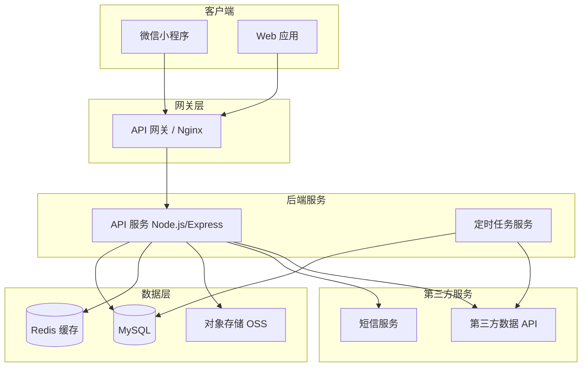
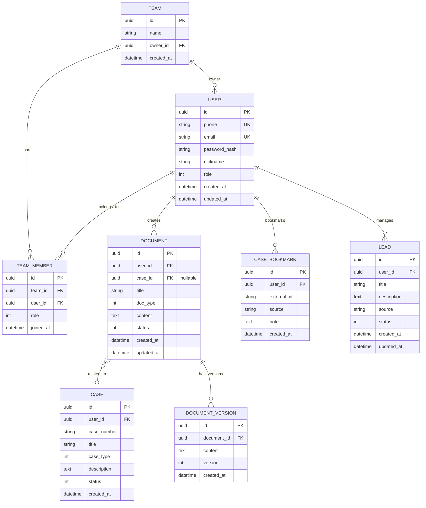
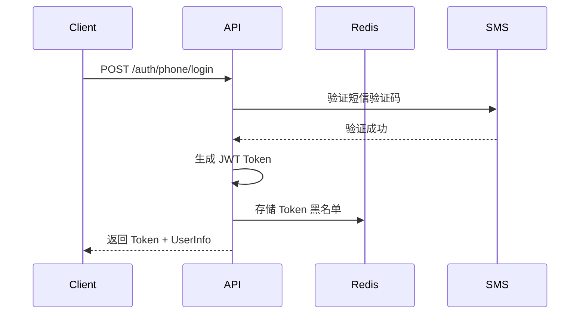
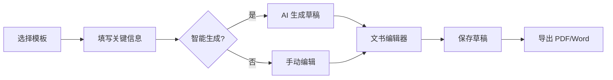
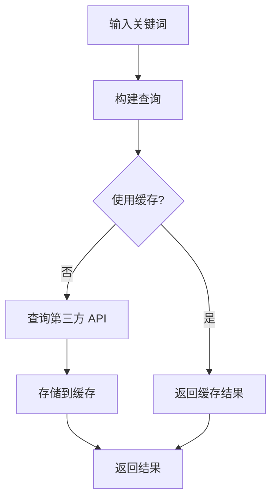
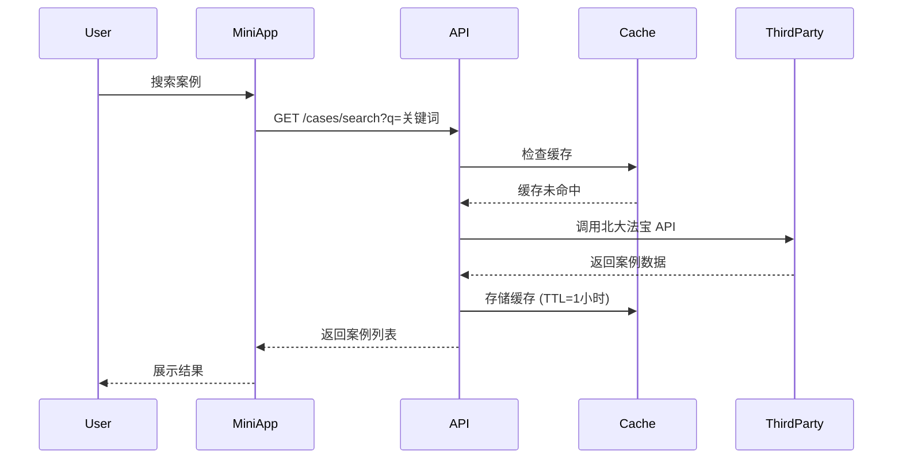
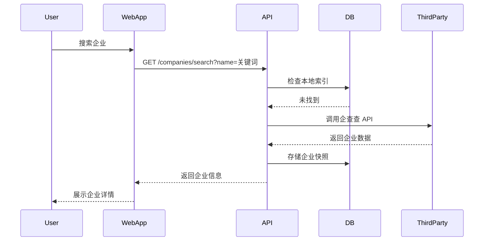
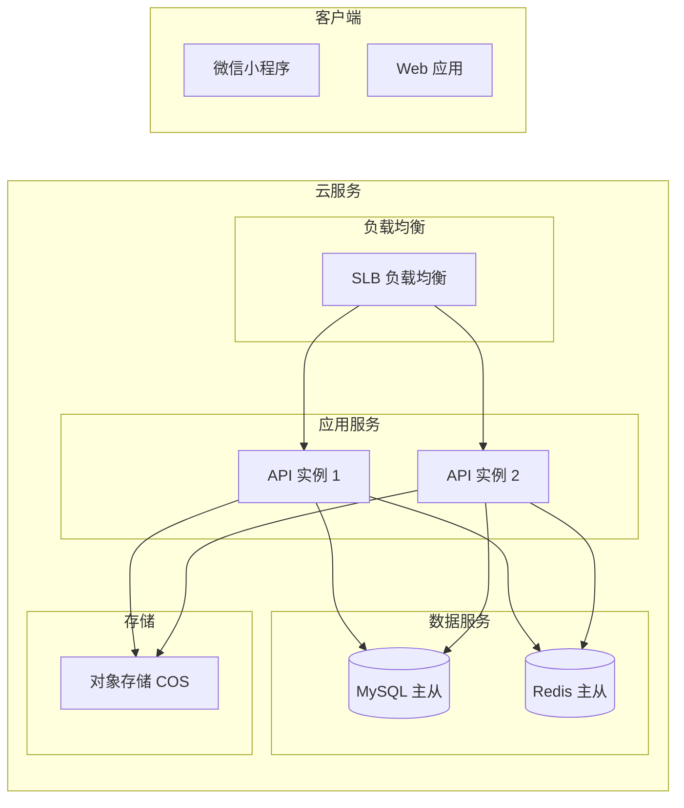

# 法律助手小程序技术设计文档

## 1. 项目概述

### 1.1 项目信息
- **项目名称**：法律助手 (LegalAssistant)
- **版本**：v1.0.0 (MVP)
- **更新日期**：2026-05-07
- **项目类型**：微信小程序 + Web 应用双端

### 1.2 技术架构概览



## 2. 技术选型

### 2.1 前端技术栈

| 层级 | 技术 | 说明 |
|-----|------|------|
| 小程序框架 | uni-app | 一套代码，编译为微信小程序 + H5 |
| Web 框架 | Vue 3 + Vite | 响应式 Web 应用 |
| 状态管理 | Pinia | Vue 3 官方推荐状态管理 |
| UI 组件库 | uView / Element Plus | 小程序 / Web 端 UI 组件 |
| HTTP 客户端 | Axios | HTTP 请求封装 |
| 路由管理 | Vue Router | Web 端路由 |

### 2.2 后端技术栈

| 层级 | 技术 | 说明 |
|-----|------|------|
| 运行时 | Node.js 18+ | JavaScript 运行时 |
| Web 框架 | Express.js / NestJS | API 开发框架 |
| ORM | Prisma | 数据库 ORM 框架 |
| 数据库 | MySQL 8.0 | 关系型数据库 |
| 缓存 | Redis 7.0 | 缓存和会话存储 |
| 对象存储 | 腾讯云 COS | 文件存储 |
| 认证 | JWT | 无状态认证 |
| 验证 | Joi / class-validator | 参数验证 |

### 2.3 开发与部署

| 类型 | 技术 | 说明 |
|-----|------|------|
| 代码仓库 | Git | 版本控制 |
| CI/CD | GitHub Actions | 自动化构建部署 |
| 容器化 | Docker | 环境一致性 |
| 服务器 | 腾讯云 CVM | 云服务器 |
| 小程序发布 | 微信公众平台 | 小程序提交审核 |

## 3. 数据库设计

### 3.1 ER 图



### 3.2 主要表结构

#### 用户表 (user)
```sql
CREATE TABLE user (
    id CHAR(36) PRIMARY KEY,
    phone VARCHAR(20) UNIQUE,
    email VARCHAR(255) UNIQUE,
    password_hash VARCHAR(255) NOT NULL,
    nickname VARCHAR(100),
    avatar_url VARCHAR(500),
    role ENUM('admin', 'lawyer', 'assistant', 'guest') DEFAULT 'lawyer',
    status TINYINT DEFAULT 1,
    created_at TIMESTAMP DEFAULT CURRENT_TIMESTAMP,
    updated_at TIMESTAMP DEFAULT CURRENT_TIMESTAMP ON UPDATE CURRENT_TIMESTAMP,
    INDEX idx_phone (phone),
    INDEX idx_email (email)
);
```

#### 团队表 (team)
```sql
CREATE TABLE team (
    id CHAR(36) PRIMARY KEY,
    name VARCHAR(200) NOT NULL,
    owner_id CHAR(36) NOT NULL,
    invite_code VARCHAR(20) UNIQUE,
    created_at TIMESTAMP DEFAULT CURRENT_TIMESTAMP,
    FOREIGN KEY (owner_id) REFERENCES user(id)
);
```

#### 文书表 (document)
```sql
CREATE TABLE document (
    id CHAR(36) PRIMARY KEY,
    user_id CHAR(36) NOT NULL,
    case_id CHAR(36),
    title VARCHAR(500) NOT NULL,
    doc_type ENUM('contract', 'litigation', 'non_litigation', 'other') NOT NULL,
    content LONGTEXT,
    status ENUM('draft', 'final', 'archived') DEFAULT 'draft',
    version INT DEFAULT 1,
    created_at TIMESTAMP DEFAULT CURRENT_TIMESTAMP,
    updated_at TIMESTAMP DEFAULT CURRENT_TIMESTAMP ON UPDATE CURRENT_TIMESTAMP,
    FOREIGN KEY (user_id) REFERENCES user(id),
    FOREIGN KEY (case_id) REFERENCES case(id),
    INDEX idx_user_id (user_id),
    INDEX idx_case_id (case_id)
);
```

#### 案例收藏表 (case_bookmark)
```sql
CREATE TABLE case_bookmark (
    id CHAR(36) PRIMARY KEY,
    user_id CHAR(36) NOT NULL,
    external_id VARCHAR(100) NOT NULL,
    source VARCHAR(50) NOT NULL,
    title VARCHAR(500),
    note TEXT,
    created_at TIMESTAMP DEFAULT CURRENT_TIMESTAMP,
    FOREIGN KEY (user_id) REFERENCES user(id),
    UNIQUE KEY uk_user_external (user_id, external_id, source)
);
```

#### 案源线索表 (lead)
```sql
CREATE TABLE lead (
    id CHAR(36) PRIMARY KEY,
    user_id CHAR(36) NOT NULL,
    title VARCHAR(500) NOT NULL,
    description TEXT,
    source VARCHAR(100),
    tags JSON,
    status ENUM('new', 'contacted', 'following', 'converted', 'discarded') DEFAULT 'new',
    created_at TIMESTAMP DEFAULT CURRENT_TIMESTAMP,
    updated_at TIMESTAMP DEFAULT CURRENT_TIMESTAMP ON UPDATE CURRENT_TIMESTAMP,
    FOREIGN KEY (user_id) REFERENCES user(id),
    INDEX idx_user_status (user_id, status)
);
```

## 4. API 接口设计

### 4.1 API 规范

- **基础路径**：`/api/v1`
- **认证方式**：JWT Bearer Token
- **请求格式**：JSON
- **响应格式**：
```json
{
    "code": 0,
    "message": "success",
    "data": {}
}
```

### 4.2 核心接口

#### 认证模块

| 方法 | 路径 | 描述 |
|-----|------|------|
| POST | /auth/phone/login | 手机号+验证码登录 |
| POST | /auth/wechat/login | 微信登录 |
| POST | /auth/email/login | 邮箱+密码登录 |
| POST | /auth/register | 用户注册 |
| POST | /auth/sms/send | 发送短信验证码 |
| POST | /auth/refresh | 刷新 Token |
| POST | /auth/logout | 登出 |

#### 用户模块

| 方法 | 路径 | 描述 |
|-----|------|------|
| GET | /user/profile | 获取用户信息 |
| PUT | /user/profile | 更新用户信息 |
| PUT | /user/password | 修改密码 |

#### 文书模块

| 方法 | 路径 | 描述 |
|-----|------|------|
| GET | /documents | 获取文书列表 |
| POST | /documents | 创建文书 |
| GET | /documents/:id | 获取文书详情 |
| PUT | /documents/:id | 更新文书 |
| DELETE | /documents/:id | 删除文书 |
| GET | /documents/:id/versions | 获取版本历史 |
| POST | /documents/:id/export | 导出文书 |

#### 案例查询模块

| 方法 | 路径 | 描述 |
|-----|------|------|
| GET | /cases/search | 搜索案例 |
| GET | /cases/:id | 获取案例详情 |
| GET | /cases/:id/similar | 获取相似案例 |
| POST | /cases/bookmark | 收藏案例 |
| GET | /cases/bookmarks | 获取收藏列表 |

#### 法规查询模块

| 方法 | 路径 | 描述 |
|-----|------|------|
| GET | /laws/search | 搜索法规 |
| GET | /laws/:id | 获取法规详情 |
| GET | /laws/:id/related | 获取相关法规 |

#### 企业查询模块

| 方法 | 路径 | 描述 |
|-----|------|------|
| GET | /companies/search | 搜索企业 |
| GET | /companies/:id | 获取企业详情 |
| GET | /companies/:id/shareholders | 获取股东信息 |
| GET | /companies/:id/risk | 获取风险信息 |
| GET | /companies/:id/graph | 获取企业关系图谱 |

#### 案源模块

| 方法 | 路径 | 描述 |
|-----|------|------|
| GET | /leads | 获取案源列表 |
| POST | /leads | 创建案源 |
| PUT | /leads/:id | 更新案源 |
| DELETE | /leads/:id | 删除案源 |
| PUT | /leads/:id/status | 更新案源状态 |

#### 管理模块

| 方法 | 路径 | 描述 |
|-----|------|------|
| GET | /admin/users | 用户列表 |
| POST | /admin/team | 创建团队 |
| GET | /admin/team/:id | 团队详情 |
| POST | /admin/team/:id/members | 添加团队成员 |

### 4.3 请求/响应示例

#### 用户登录
```json
// POST /api/v1/auth/phone/login
// Request
{
    "phone": "13800138000",
    "code": "123456"
}

// Response
{
    "code": 0,
    "message": "success",
    "data": {
        "token": "eyJhbGciOiJIUzI1NiIs...",
        "refreshToken": "eyJhbGciOiJIUzI1NiIs...",
        "user": {
            "id": "550e8400-e29b-41d4-a716-446655440000",
            "phone": "13800138000",
            "nickname": "张三律师",
            "role": "lawyer"
        }
    }
}
```

## 5. 核心模块设计

### 5.1 认证模块



### 5.2 文书起草模块



### 5.3 案例查询模块



## 6. 数据流向

### 6.1 案例查询流程



### 6.2 企业查询流程



## 7. 第三方数据集成

### 7.1 集成方案

| 数据类型 | 推荐数据源 | 费用模式 |
|---------|-----------|---------|
| 裁判文书 | 北大法宝、OpenLaw | 按量计费 |
| 法规数据 | 国家法规数据库、威科先行 | 按量计费 |
| 企业工商 | 企查查、天眼查、爱企查 | 按量计费 |
| 企业风险 | 中国执行信息公开网 | 免费 |
| 短信服务 | 腾讯云短信 | 按条计费 |

### 7.2 数据缓存策略

| 数据类型 | 缓存时间 | 更新策略 |
|---------|---------|---------|
| 案例搜索结果 | 1 小时 | 主动刷新 + 手动刷新 |
| 法规正文 | 24 小时 | 主动刷新 |
| 企业工商信息 | 12 小时 | 主动刷新 |
| 企业风险信息 | 1 小时 | 实时查询 |

## 8. 安全设计

### 8.1 认证与授权

- JWT Token 有效期：7 天
- Refresh Token 有效期：30 天
- Token 存储：HttpOnly Cookie 或 SecureStorage
- 密码加密：bcrypt (cost factor 12)

### 8.2 接口安全

- 所有接口需要认证（公开接口除外）
- 接口频率限制：普通用户 100 次/分钟
- 参数验证：使用 Joi/class-validator
- SQL 注入防护：使用 Prisma ORM 参数化查询
- XSS 防护：输入转义 + Content-Type 限制

### 8.3 数据安全

- 敏感数据加密存储
- 传输层使用 HTTPS
- 定期备份数据库
- 审计日志记录关键操作

## 9. 部署架构

### 9.1 MVP 部署拓扑



### 9.2 环境配置

| 环境 | 用途 | 配置 |
|-----|------|------|
| 开发环境 | 本地开发 | local |
| 测试环境 | 功能测试 | test |
| 预发布环境 | 灰度发布 | staging |
| 生产环境 | 正式运营 | production |

## 10. 项目结构

```
legal-assistant/
├── docs/                      # 项目文档
├── server/                    # 后端服务
│   ├── src/
│   │   ├── modules/          # 功能模块
│   │   │   ├── auth/         # 认证模块
│   │   │   ├── user/         # 用户模块
│   │   │   ├── document/     # 文书模块
│   │   │   ├── case/         # 案例模块
│   │   │   ├── law/          # 法规模块
│   │   │   ├── company/      # 企业模块
│   │   │   └── lead/         # 案源模块
│   │   ├── common/           # 公共模块
│   │   │   ├── decorators/   # 装饰器
│   │   │   ├── filters/      # 异常过滤器
│   │   │   ├── guards/       # 路由守卫
│   │   │   ├── interceptors/ # 拦截器
│   │   │   └── middleware/   # 中间件
│   │   ├── config/           # 配置文件
│   │   ├── database/         # 数据库相关
│   │   │   ├── prisma/       # Prisma 配置
│   │   │   └── migrations/   # 数据库迁移
│   │   ├── dto/              # 数据传输对象
│   │   ├── entities/         # 实体定义
│   │   ├── services/         # 业务服务
│   │   └── main.ts           # 入口文件
│   ├── test/                 # 测试文件
│   ├── package.json
│   └── tsconfig.json
├── client/                    # 前端（小程序/Web）
│   ├── src/
│   │   ├── pages/            # 页面
│   │   ├── components/       # 组件
│   │   ├── stores/           # 状态管理
│   │   ├── services/         # API 服务
│   │   ├── utils/            # 工具函数
│   │   ├── static/           # 静态资源
│   │   ├── App.vue           # 应用入口
│   │   └── main.ts          # 主入口
│   ├── public/              # 公共资源
│   ├── package.json
│   └── vite.config.ts
├── docker/                   # Docker 配置
├── scripts/                  # 脚本
├── .env.example             # 环境变量示例
├── docker-compose.yml       # Docker Compose 配置
└── README.md                # 项目说明
```

## 11. 验收标准

### 11.1 功能验收

| 模块 | 功能点 | 验收标准 |
|-----|-------|---------|
| 认证 | 手机号登录 | 可发送验证码并登录 |
| 认证 | 微信登录 | 小程序端可一键登录 |
| 文书 | 模板浏览 | 可查看和搜索文书模板 |
| 文书 | 文书创建 | 可填写信息生成文书草稿 |
| 文书 | 文书编辑 | 支持富文本编辑和导出 |
| 案例 | 案例搜索 | 可关键词检索裁判文书 |
| 案例 | 案例详情 | 可查看案例完整信息和文书 |
| 法规 | 法规搜索 | 可检索法规条文 |
| 法规 | 法规详情 | 可查看法规完整内容和相关法规 |
| 企业 | 企业搜索 | 可通过名称查询企业信息 |
| 企业 | 企业详情 | 可查看工商、股东、风险信息 |
| 案源 | 案源管理 | 可添加、编辑、跟踪案源线索 |

### 11.2 性能验收

- 页面首屏加载时间 < 3 秒
- 搜索接口响应时间 < 2 秒
- 支持 100 并发用户

### 11.3 安全验收

- 密码加密存储
- JWT Token 有效期内可正常使用
- 无 SQL 注入和 XSS 漏洞