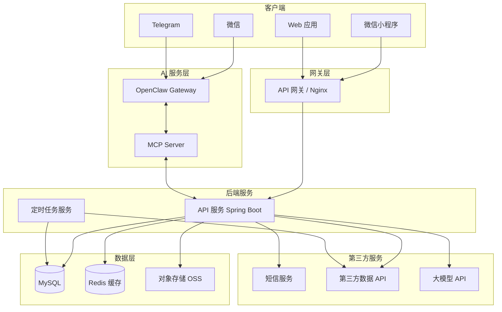
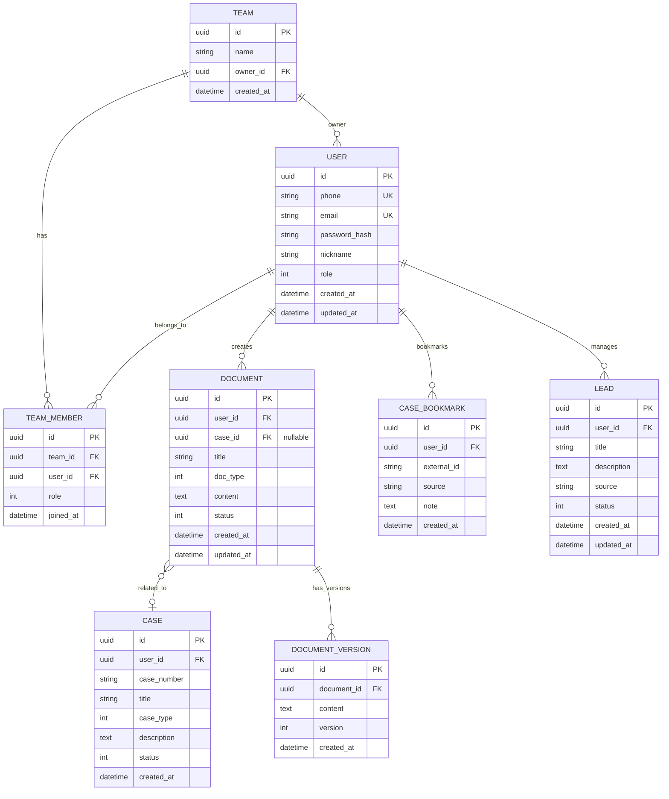
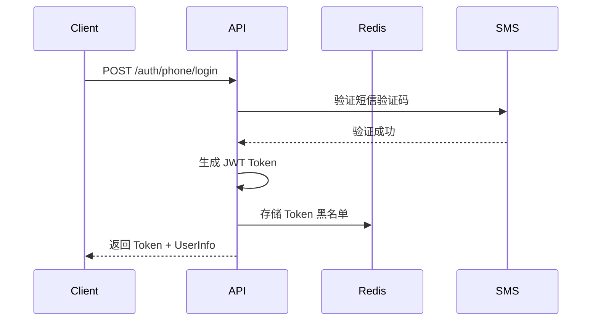
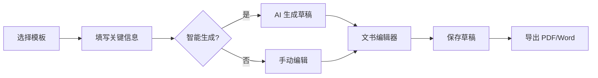
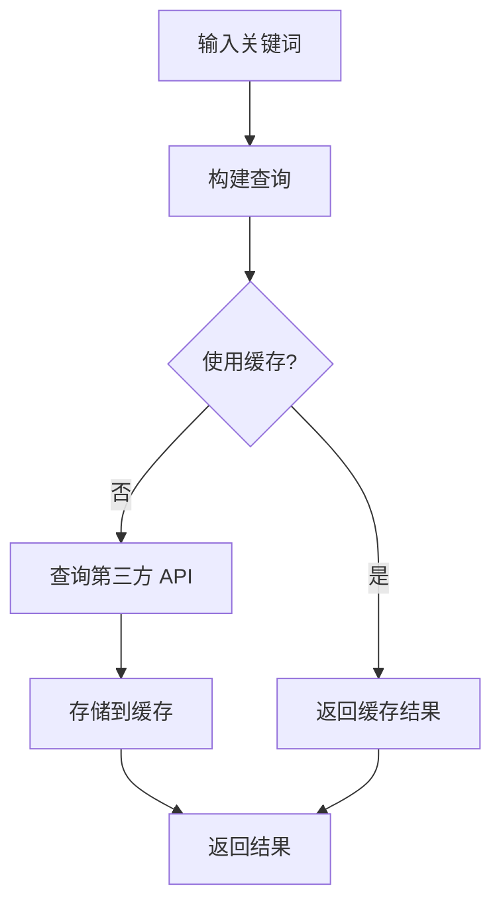
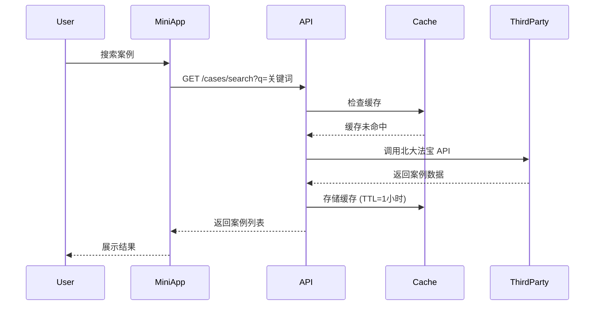
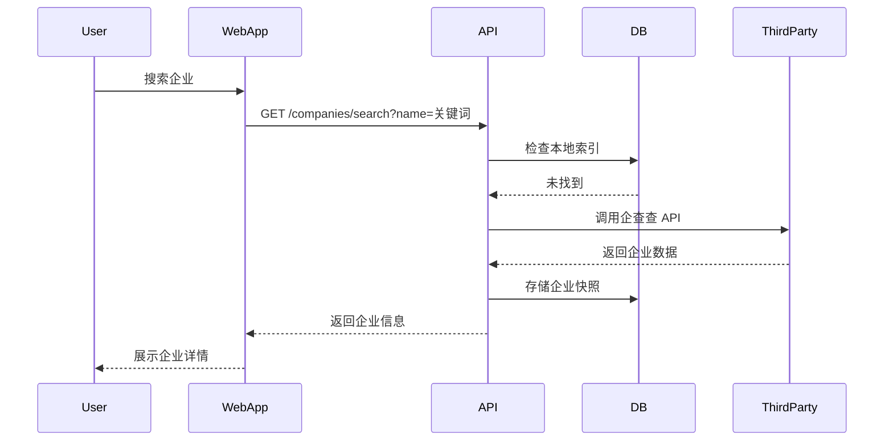
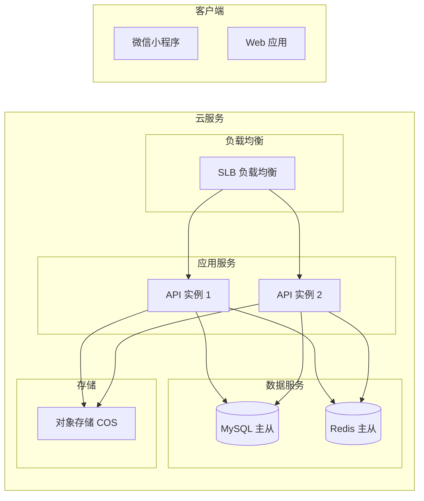
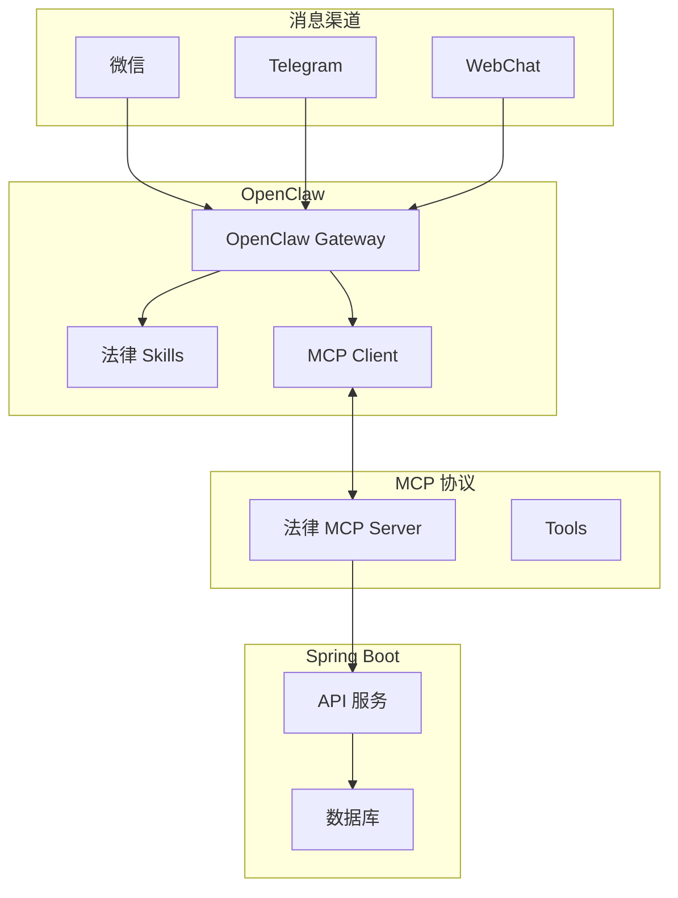

# 法律助手小程序技术设计文档

## 1. 项目概述

### 1.1 项目信息
- **项目名称**：法律助手 (LegalAssistant)
- **版本**：v1.0.0 (MVP)
- **更新日期**：2026-05-07
- **项目类型**：微信小程序 + Web 应用双端

### 1.2 技术架构概览



## 2. 技术选型

### 2.1 前端技术栈

| 层级 | 技术 | 说明 |
|-----|------|------|
| 小程序框架 | uni-app | 一套代码，编译为微信小程序 + H5 |
| Web 框架 | Vue 3 + Vite | 响应式 Web 应用 |
| 状态管理 | Pinia | Vue 3 官方推荐状态管理 |
| UI 组件库 | uView / Element Plus | 小程序 / Web 端 UI 组件 |
| HTTP 客户端 | Axios | HTTP 请求封装 |
| 路由管理 | Vue Router | Web 端路由 |

### 2.2 后端技术栈

| 层级 | 技术 | 说明 |
|-----|------|------|
| 运行时 | Java 17+ | JDK 17 LTS |
| Web 框架 | Spring Boot 3.x | 企业级 Java 框架 |
| ORM | MyBatis-Plus | 数据库 ORM 框架 |
| 数据库 | MySQL 8.0 | 关系型数据库 |
| 缓存 | Redis 7.0 | 缓存和会话存储 |
| 对象存储 | 腾讯云 COS | 文件存储 |
| 认证 | JWT | 无状态认证 |
| 验证 | Spring Validation | 参数校验 |
| 任务调度 | XXL-Job | 分布式任务调度 |

### 2.3 AI 服务技术栈

| 层级 | 技术 | 说明 |
|-----|------|------|
| AI 框架 | OpenClaw | 个人 AI 助手网关 (369k+ stars) |
| 消息渠道 | 微信/Telegram/Web | 多渠道消息接入 |
| 协议 | MCP (Model Context Protocol) | AI 工具集成协议 |
| 法律 Skills | 自研法律技能包 | 案例分析、文书审查、法律问答 |
| 大模型 | OpenAI / Claude / 本地模型 | AI 推理能力 |

### 2.4 开发与部署

| 类型 | 技术 | 说明 |
|-----|------|------|
| 代码仓库 | Git | 版本控制 |
| CI/CD | GitHub Actions | 自动化构建部署 |
| 容器化 | Docker | 环境一致性 |
| 服务器 | 腾讯云 CVM | 云服务器 |
| 小程序发布 | 微信公众平台 | 小程序提交审核 |

## 3. 数据库设计

### 3.1 ER 图



### 3.2 主要表结构

#### 用户表 (user)
```sql
CREATE TABLE user (
    id CHAR(36) PRIMARY KEY,
    phone VARCHAR(20) UNIQUE,
    email VARCHAR(255) UNIQUE,
    password_hash VARCHAR(255) NOT NULL,
    nickname VARCHAR(100),
    avatar_url VARCHAR(500),
    role ENUM('admin', 'lawyer', 'assistant', 'guest') DEFAULT 'lawyer',
    status TINYINT DEFAULT 1,
    created_at TIMESTAMP DEFAULT CURRENT_TIMESTAMP,
    updated_at TIMESTAMP DEFAULT CURRENT_TIMESTAMP ON UPDATE CURRENT_TIMESTAMP,
    INDEX idx_phone (phone),
    INDEX idx_email (email)
);
```

#### 团队表 (team)
```sql
CREATE TABLE team (
    id CHAR(36) PRIMARY KEY,
    name VARCHAR(200) NOT NULL,
    owner_id CHAR(36) NOT NULL,
    invite_code VARCHAR(20) UNIQUE,
    created_at TIMESTAMP DEFAULT CURRENT_TIMESTAMP,
    FOREIGN KEY (owner_id) REFERENCES user(id)
);
```

#### 文书表 (document)
```sql
CREATE TABLE document (
    id CHAR(36) PRIMARY KEY,
    user_id CHAR(36) NOT NULL,
    case_id CHAR(36),
    title VARCHAR(500) NOT NULL,
    doc_type ENUM('contract', 'litigation', 'non_litigation', 'other') NOT NULL,
    content LONGTEXT,
    status ENUM('draft', 'final', 'archived') DEFAULT 'draft',
    version INT DEFAULT 1,
    created_at TIMESTAMP DEFAULT CURRENT_TIMESTAMP,
    updated_at TIMESTAMP DEFAULT CURRENT_TIMESTAMP ON UPDATE CURRENT_TIMESTAMP,
    FOREIGN KEY (user_id) REFERENCES user(id),
    FOREIGN KEY (case_id) REFERENCES case(id),
    INDEX idx_user_id (user_id),
    INDEX idx_case_id (case_id)
);
```

#### 案例收藏表 (case_bookmark)
```sql
CREATE TABLE case_bookmark (
    id CHAR(36) PRIMARY KEY,
    user_id CHAR(36) NOT NULL,
    external_id VARCHAR(100) NOT NULL,
    source VARCHAR(50) NOT NULL,
    title VARCHAR(500),
    note TEXT,
    created_at TIMESTAMP DEFAULT CURRENT_TIMESTAMP,
    FOREIGN KEY (user_id) REFERENCES user(id),
    UNIQUE KEY uk_user_external (user_id, external_id, source)
);
```

#### 案源线索表 (lead)
```sql
CREATE TABLE lead (
    id CHAR(36) PRIMARY KEY,
    user_id CHAR(36) NOT NULL,
    title VARCHAR(500) NOT NULL,
    description TEXT,
    source VARCHAR(100),
    tags JSON,
    status ENUM('new', 'contacted', 'following', 'converted', 'discarded') DEFAULT 'new',
    created_at TIMESTAMP DEFAULT CURRENT_TIMESTAMP,
    updated_at TIMESTAMP DEFAULT CURRENT_TIMESTAMP ON UPDATE CURRENT_TIMESTAMP,
    FOREIGN KEY (user_id) REFERENCES user(id),
    INDEX idx_user_status (user_id, status)
);
```

## 4. API 接口设计

### 4.1 API 规范

- **基础路径**：`/api/v1`
- **认证方式**：JWT Bearer Token
- **请求格式**：JSON
- **响应格式**：
```json
{
    "code": 0,
    "message": "success",
    "data": {}
}
```

### 4.2 核心接口

#### 认证模块

| 方法 | 路径 | 描述 |
|-----|------|------|
| POST | /auth/phone/login | 手机号+验证码登录 |
| POST | /auth/wechat/login | 微信登录 |
| POST | /auth/email/login | 邮箱+密码登录 |
| POST | /auth/register | 用户注册 |
| POST | /auth/sms/send | 发送短信验证码 |
| POST | /auth/refresh | 刷新 Token |
| POST | /auth/logout | 登出 |

#### 用户模块

| 方法 | 路径 | 描述 |
|-----|------|------|
| GET | /user/profile | 获取用户信息 |
| PUT | /user/profile | 更新用户信息 |
| PUT | /user/password | 修改密码 |

#### 文书模块

| 方法 | 路径 | 描述 |
|-----|------|------|
| GET | /documents | 获取文书列表 |
| POST | /documents | 创建文书 |
| GET | /documents/:id | 获取文书详情 |
| PUT | /documents/:id | 更新文书 |
| DELETE | /documents/:id | 删除文书 |
| GET | /documents/:id/versions | 获取版本历史 |
| POST | /documents/:id/export | 导出文书 |

#### 案例查询模块

| 方法 | 路径 | 描述 |
|-----|------|------|
| GET | /cases/search | 搜索案例 |
| GET | /cases/:id | 获取案例详情 |
| GET | /cases/:id/similar | 获取相似案例 |
| POST | /cases/bookmark | 收藏案例 |
| GET | /cases/bookmarks | 获取收藏列表 |

#### 法规查询模块

| 方法 | 路径 | 描述 |
|-----|------|------|
| GET | /laws/search | 搜索法规 |
| GET | /laws/:id | 获取法规详情 |
| GET | /laws/:id/related | 获取相关法规 |

#### 企业查询模块

| 方法 | 路径 | 描述 |
|-----|------|------|
| GET | /companies/search | 搜索企业 |
| GET | /companies/:id | 获取企业详情 |
| GET | /companies/:id/shareholders | 获取股东信息 |
| GET | /companies/:id/risk | 获取风险信息 |
| GET | /companies/:id/graph | 获取企业关系图谱 |

#### 案源模块

| 方法 | 路径 | 描述 |
|-----|------|------|
| GET | /leads | 获取案源列表 |
| POST | /leads | 创建案源 |
| PUT | /leads/:id | 更新案源 |
| DELETE | /leads/:id | 删除案源 |
| PUT | /leads/:id/status | 更新案源状态 |

#### 管理模块

| 方法 | 路径 | 描述 |
|-----|------|------|
| GET | /admin/users | 用户列表 |
| POST | /admin/team | 创建团队 |
| GET | /admin/team/:id | 团队详情 |
| POST | /admin/team/:id/members | 添加团队成员 |

### 4.3 请求/响应示例

#### 用户登录
```json
// POST /api/v1/auth/phone/login
// Request
{
    "phone": "13800138000",
    "code": "123456"
}

// Response
{
    "code": 0,
    "message": "success",
    "data": {
        "token": "eyJhbGciOiJIUzI1NiIs...",
        "refreshToken": "eyJhbGciOiJIUzI1NiIs...",
        "user": {
            "id": "550e8400-e29b-41d4-a716-446655440000",
            "phone": "13800138000",
            "nickname": "张三律师",
            "role": "lawyer"
        }
    }
}
```

## 5. 核心模块设计

### 5.1 认证模块



### 5.2 文书起草模块



### 5.3 案例查询模块



## 6. 数据流向

### 6.1 案例查询流程



### 6.2 企业查询流程



## 7. 第三方数据集成

### 7.1 集成方案

| 数据类型 | 推荐数据源 | 费用模式 |
|---------|-----------|---------|
| 裁判文书 | 北大法宝、OpenLaw | 按量计费 |
| 法规数据 | 国家法规数据库、威科先行 | 按量计费 |
| 企业工商 | 企查查、天眼查、爱企查 | 按量计费 |
| 企业风险 | 中国执行信息公开网 | 免费 |
| 短信服务 | 腾讯云短信 | 按条计费 |

### 7.2 数据缓存策略

| 数据类型 | 缓存时间 | 更新策略 |
|---------|---------|---------|
| 案例搜索结果 | 1 小时 | 主动刷新 + 手动刷新 |
| 法规正文 | 24 小时 | 主动刷新 |
| 企业工商信息 | 12 小时 | 主动刷新 |
| 企业风险信息 | 1 小时 | 实时查询 |

## 8. 安全设计

### 8.1 认证与授权

- JWT Token 有效期：7 天
- Refresh Token 有效期：30 天
- Token 存储：HttpOnly Cookie 或 SecureStorage
- 密码加密：bcrypt (cost factor 12)

### 8.2 接口安全

- 所有接口需要认证（公开接口除外）
- 接口频率限制：普通用户 100 次/分钟
- 参数验证：使用 Spring Validation 注解
- SQL 注入防护：使用 MyBatis-Plus 参数绑定
- XSS 防护：输入转义 + Content-Type 限制

### 8.3 数据安全

- 敏感数据加密存储
- 传输层使用 HTTPS
- 定期备份数据库
- 审计日志记录关键操作

## 9. 部署架构

### 9.1 MVP 部署拓扑



### 9.2 环境配置

| 环境 | 用途 | 配置 |
|-----|------|------|
| 开发环境 | 本地开发 | local |
| 测试环境 | 功能测试 | test |
| 预发布环境 | 灰度发布 | staging |
| 生产环境 | 正式运营 | production |

## 10. 项目结构

```
legal-assistant/
├── docs/                      # 项目文档
├── server/                    # 后端服务 (Spring Boot)
│   ├── src/
│   │   └── main/
│   │       ├── java/
│   │       │   └── com/legal/assistant/
│   │       │       ├── LegalAssistantApplication.java  # 启动类
│   │       │       ├── config/                        # 配置类
│   │       │       │   ├── SecurityConfig.java         # 安全配置
│   │       │       │   ├── RedisConfig.java            # Redis 配置
│   │       │       │   ├── CorsConfig.java             # 跨域配置
│   │       │       │   └── McpConfig.java              # MCP 协议配置
│   │       │       ├── module/                         # 功能模块
│   │       │       │   ├── auth/                       # 认证模块
│   │       │       │   │   ├── controller/
│   │       │       │   │   ├── service/
│   │   │       │   │   ├── mapper/
│   │   │       │   │   └── entity/
│   │       │       │   ├── user/                       # 用户模块
│   │       │       │   ├── document/                   # 文书模块
│   │       │       │   ├── case/                       # 案例模块
│   │       │       │   ├── law/                        # 法规模块
│   │       │       │   ├── company/                    # 企业模块
│   │       │       │   └── lead/                       # 案源模块
│   │       │       ├── mcp/                            # MCP 服务
│   │       │       │   ├── LegalMcpServer.java         # 法律 MCP 服务器
│   │       │       │   ├── tools/                      # MCP 工具定义
│   │       │       │   │   ├── case_search_tool.java
│   │       │       │   │   ├── law_search_tool.java
│   │       │       │   │   ├── company_search_tool.java
│   │       │       │   │   └── document_tool.java
│   │       │       │   └── handlers/                    # 工具处理器
│   │       │       ├── common/                         # 公共模块
│   │       │       │   ├── result/                     # 统一返回
│   │       │       │   ├── exception/                  # 异常处理
│   │       │       │   ├── security/                   # 安全相关
│   │       │       │   └── utils/                      # 工具类
│   │       │       └── dto/                            # 数据传输对象
│   │       └── resources/
│   │           ├── application.yml                      # 主配置文件
│   │           ├── application-dev.yml                 # 开发环境配置
│   │           └── mapper/                            # MyBatis XML
│   ├── pom.xml                                         # Maven 配置
│   └── src/test/                                       # 测试文件
├── openclaw/                    # OpenClaw AI 服务
│   ├── .openclaw/              # OpenClaw 工作区
│   │   ├── workspace/
│   │   │   ├── AGENTS.md       # AI 代理配置
│   │   │   ├── SOUL.md         # AI 灵魂配置
│   │   │   ├── TOOLS.md        # 工具配置
│   │   │   └── skills/         # 法律技能包
│   │   │       ├── legal-qa/   # 法律问答技能
│   │   │       ├── case-analysis/  # 案例分析技能
│   │   │       └── document-review/ # 文书审查技能
│   │   └── config/
│   │       └── openclaw.json   # OpenClaw 配置
│   ├── extensions/              # OpenClaw 扩展
│   │   └── legal-mcp/          # 法律 MCP 客户端扩展
│   └── package.json
├── client/                    # 前端（小程序/Web）
│   ├── src/
│   │   ├── pages/            # 页面
│   │   ├── components/       # 组件
│   │   ├── stores/           # 状态管理
│   │   ├── services/         # API 服务
│   │   ├── utils/            # 工具函数
│   │   ├── static/           # 静态资源
│   │   ├── App.vue           # 应用入口
│   │   └── main.ts          # 主入口
│   ├── public/              # 公共资源
│   ├── package.json
│   └── vite.config.ts
├── docker/                   # Docker 配置
├── scripts/                  # 脚本
├── .env.example             # 环境变量示例
├── docker-compose.yml       # Docker Compose 配置
└── README.md                # 项目说明
```
legal-assistant/
├── docs/                      # 项目文档
├── server/                    # 后端服务 (Spring Boot)
│   ├── src/
│   │   └── main/
│   │       ├── java/
│   │       │   └── com/legal/assistant/
│   │       │       ├── LegalAssistantApplication.java  # 启动类
│   │       │       ├── config/                        # 配置类
│   │       │       │   ├── SecurityConfig.java         # 安全配置
│   │       │       │   ├── RedisConfig.java            # Redis 配置
│   │       │       │   └── CorsConfig.java             # 跨域配置
│   │       │       ├── module/                         # 功能模块
│   │       │       │   ├── auth/                       # 认证模块
│   │       │       │   │   ├── controller/
│   │       │       │   │   ├── service/
│   │       │       │   │   ├── mapper/
│   │       │       │   │   └── entity/
│   │       │       │   ├── user/                       # 用户模块
│   │       │       │   ├── document/                   # 文书模块
│   │       │       │   ├── case/                       # 案例模块
│   │       │       │   ├── law/                        # 法规模块
│   │       │       │   ├── company/                   # 企业模块
│   │       │       │   └── lead/                       # 案源模块
│   │       │       ├── common/                         # 公共模块
│   │       │       │   ├── result/                     # 统一返回
│   │       │       │   ├── exception/                  # 异常处理
│   │       │       │   ├── security/                   # 安全相关
│   │       │       │   └── utils/                      # 工具类
│   │       │       └── dto/                            # 数据传输对象
│   │       └── resources/
│   │           ├── application.yml                      # 主配置文件
│   │           ├── application-dev.yml                 # 开发环境配置
│   │           └── mapper/                              # MyBatis XML
│   ├── pom.xml                                         # Maven 配置
│   └── src/test/                                       # 测试文件
├── client/                    # 前端（小程序/Web）
│   ├── src/
│   │   ├── pages/            # 页面
│   │   ├── components/       # 组件
│   │   ├── stores/           # 状态管理
│   │   ├── services/         # API 服务
│   │   ├── utils/            # 工具函数
│   │   ├── static/           # 静态资源
│   │   ├── App.vue           # 应用入口
│   │   └── main.ts          # 主入口
│   ├── public/              # 公共资源
│   ├── package.json
│   └── vite.config.ts
├── docker/                   # Docker 配置
├── scripts/                  # 脚本
├── .env.example             # 环境变量示例
├── docker-compose.yml       # Docker Compose 配置
└── README.md                # 项目说明
```

## 11. OpenClaw AI 服务集成

### 11.1 OpenClaw 简介

OpenClaw 是一个开源的个人 AI 助手框架（369k+ stars, MIT 协议），支持多渠道消息接入和 MCP 协议扩展。

**核心特性**：
- 多渠道接入：微信、Telegram、Slack、Discord、WebChat 等
- 多 Agent 路由：支持为不同用户/渠道配置独立 Agent
- Skills 系统：可通过 Skill 包扩展功能
- MCP 协议：标准化 AI 工具集成
- 语音支持：Voice Wake + Talk Mode

### 11.2 集成架构



### 11.3 法律 MCP Server

MCP Server 提供 AI 工具调用后端能力：

```java
// 法律 MCP Server 工具定义
public class LegalMcpServer {
    // 案例搜索工具
    @Tool(name = "case_search", description = "搜索裁判文书案例")
    public List<Case> searchCases(
        @Argument(name = "keyword") String keyword,
        @Argument(name = "case_type") String caseType,
        @Argument(name = "region") String region
    ) { ... }

    // 法规搜索工具
    @Tool(name = "law_search", description = "搜索法律法规")
    public List<Law> searchLaws(
        @Argument(name = "keyword") String keyword,
        @Argument(name = "level") String level
    ) { ... }

    // 企业查询工具
    @Tool(name = "company_search", description = "查询企业工商信息")
    public Company searchCompany(
        @Argument(name = "name") String name
    ) { ... }

    // 文书处理工具
    @Tool(name = "document_review", description = "审查法律文书")
    public ReviewResult reviewDocument(
        @Argument(name = "content") String content,
        @Argument(name = "doc_type") String docType
    ) { ... }
}
```

### 11.4 法律 Skills

OpenClaw Skills 是预定义的 AI 工作流：

| Skill | 功能 | 描述 |
|-------|------|------|
| legal-qa | 法律问答 | 回答一般法律问题，提供法律建议 |
| case-analysis | 案例分析 | 分析案例细节，推荐相似案例 |
| document-review | 文书审查 | 审查合同条款，识别法律风险 |
| law-research | 法律研究 | 检索法规，分析法律适用 |

#### Skill 配置示例

```markdown
# legal-qa/SKILL.md

## 描述
专业法律问答助手，帮助用户解答一般法律问题。

## 工具
- case_search: 搜索相关案例
- law_search: 检索相关法规

## 工作流程
1. 理解用户法律问题
2. 搜索相关案例和法规
3. 综合分析给出回答
4. 提醒用户寻求专业律师意见

## 限制
- 不提供正式法律意见
- 不替代律师专业服务
```

### 11.5 OpenClaw 配置

```json
// openclaw/.openclaw/config/openclaw.json
{
  "gateway": {
    "port": 18789,
    "auth": {
      "enabled": true,
      "jwtSecret": "${JWT_SECRET}"
    }
  },
  "channels": {
    "wechat": {
      "enabled": true,
      "botType": "wework"
    },
    "telegram": {
      "enabled": true,
      "botToken": "${TELEGRAM_BOT_TOKEN}"
    },
    "webchat": {
      "enabled": true,
      "webSocketPath": "/ws/chat"
    }
  },
  "agents": {
    "defaults": {
      "model": "openai/gpt-4",
      "skills": ["legal-qa", "case-analysis", "document-review"]
    }
  },
  "mcp": {
    "servers": [
      {
        "name": "legal-mcp",
        "url": "http://localhost:8080/api/mcp"
      }
    ]
  }
}
```

### 11.6 渠道接入配置

#### 微信接入 (企业微信)

```yaml
# openclaw/.openclaw/config/channels/wechat.yaml
wechat:
  botType: wework
  corpId: ${WECORK_CORP_ID}
  agentId: ${WECHAT_AGENT_ID}
  secret: ${WECHAT_SECRET}
  token: ${WECHAT_TOKEN}
  encodingAesKey: ${WECHAT_AES_KEY}
```

#### Telegram 接入

```yaml
# openclaw/.openclaw/config/channels/telegram.yaml
telegram:
  botToken: ${TELEGRAM_BOT_TOKEN}
  dmPolicy: pairing
  allowFrom:
    - ${ALLOWED_TELEGRAM_USERS}
```

### 11.7 OpenClaw 启动

```bash
# 1. 安装 OpenClaw
npm install -g openclaw@latest

# 2. 初始化配置
cd openclaw
openclaw setup

# 3. 启动网关
openclaw gateway --port 18789

# 4. 启动 MCP Server (在 server 目录)
cd ../server
mvn spring-boot:run

# 5. 通过 Docker 启动所有服务
docker-compose up -d
```

## 12. 验收标准

### 12.1 功能验收

| 模块 | 功能点 | 验收标准 |
|-----|-------|---------|
| 认证 | 手机号登录 | 可发送验证码并登录 |
| 认证 | 微信登录 | 小程序端可一键登录 |
| 文书 | 模板浏览 | 可查看和搜索文书模板 |
| 文书 | 文书创建 | 可填写信息生成文书草稿 |
| 文书 | 文书编辑 | 支持富文本编辑和导出 |
| 案例 | 案例搜索 | 可关键词检索裁判文书 |
| 案例 | 案例详情 | 可查看案例完整信息和文书 |
| 法规 | 法规搜索 | 可检索法规条文 |
| 法规 | 法规详情 | 可查看法规完整内容和相关法规 |
| 企业 | 企业搜索 | 可通过名称查询企业信息 |
| 企业 | 企业详情 | 可查看工商、股东、风险信息 |
| 案源 | 案源管理 | 可添加、编辑、跟踪案源线索 |
| AI | 微信接入 | 可通过企业微信与 AI 助手对话 |
| AI | Telegram 接入 | 可通过 Telegram Bot 与 AI 助手对话 |
| AI | Web 对话 | 可在 Web 端与 AI 助手对话 |
| AI | 法律问答 | AI 可回答一般法律问题 |
| AI | 案例分析 | AI 可分析案例并推荐相似案例 |
| AI | 文书审查 | AI 可审查合同并识别风险 |

### 12.2 性能验收

- 页面首屏加载时间 < 3 秒
- 搜索接口响应时间 < 2 秒
- 支持 100 并发用户
- AI 对话响应时间 < 5 秒

### 12.3 安全验收

- 密码加密存储
- JWT Token 有效期内可正常使用
- 无 SQL 注入和 XSS 漏洞